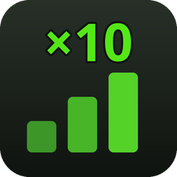
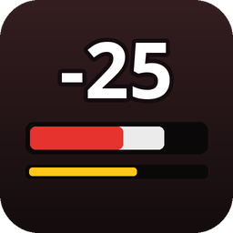
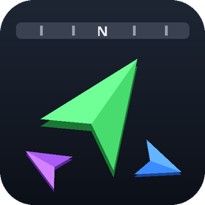
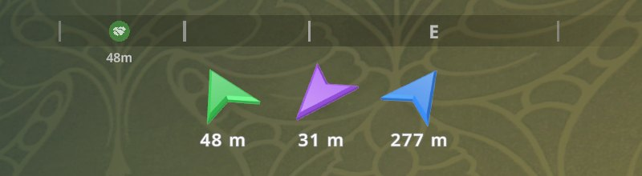

# Schedule I Mods

[MelonLoader](https://github.com/LavaGang/MelonLoader) mods for [Schedule I](https://store.steampowered.com/app/3164500/Schedule_I/).
Every mod is built for both game branches (IL2CPP and Mono) from the same code.

| | Mod | What it does |
|---|---|---|
|  | **[Polyglot](mods/Polyglot)** | Play the whole game in 13 languages and switch between them instantly, in game. |
|  | **[World Rates](mods/WorldRates)** | Server-style rates like on Rust servers: XP, income, deal frequency and storage multipliers, tuned per world in a native in-game window. |
|  | **[Damage Indicator](mods/DamageIndicator)** | Health bars and floating damage numbers, hidden until someone takes damage; stun bar and KO badges; your own movable health bar. |
|  | **[Guide Arrows](mods/GuideArrows)** | 3D arrows under the compass pointing at the nearest deal, buyer, stash, quest, potential customer and home base, each in its own color; what they point at glows through walls. |
|  | **[Quiet Pause](mods/QuietPause)** | Mutes the game while minimized and pauses world sounds in the pause menu. |
|  | **[Electric Scooter](mods/ElectricScooter)** | An electric scooter at the skate shop: rides like the Golden Skateboard, but rolls over curbs, uses no stamina and is 30% faster. |

<p>
  
  
</p>
<p>
  
  
</p>

## Installation

**With a mod manager** (r2modman, Thunderstore App): every mod is on [Thunderstore](https://thunderstore.io/c/schedule-i/p/BbIJABNPOBATEJb/) — `<Mod>` for the default Steam branch (IL2CPP), `<Mod>_Mono` for `alternate`.

**Nexus Mods:** [Polyglot](https://www.nexusmods.com/schedule1/mods/2748) · [World Rates](https://www.nexusmods.com/schedule1/mods/2753) · [Damage Indicator](https://www.nexusmods.com/schedule1/mods/2751) · [Guide Arrows](https://www.nexusmods.com/schedule1/mods/2750) · [Quiet Pause](https://www.nexusmods.com/schedule1/mods/2752) · [Electric Scooter](https://www.nexusmods.com/schedule1/mods/2754).

**Manually:**

1. Install [MelonLoader](https://github.com/LavaGang/MelonLoader/releases) **0.7.3** (or 0.7.2/0.7.0 — 0.7.1 is known to break Schedule I mods).
2. Download the mod from [Releases](https://github.com/BbIJABNPOBATEJb/ScheduleI-Mods/releases) — pick the ZIP for your game branch:
   - `IL2CPP` — the default Steam branch (and `beta`).
   - `Mono` — the `alternate` and `alternate-beta` branches.
3. Extract it into the game folder, so the DLL ends up in `Schedule I/Mods/`.

Don't install both runtime builds of a mod at the same time. The mods are independent of each other
and work together (Polyglot also translates the other mods' windows).

Tested with Schedule I **0.4.6f13** and the **0.4.7 beta** (0.4.7f7), MelonLoader **0.7.3**. One build of each mod runs on both game versions.

## Building from source

Requirements: .NET SDK 6 or newer, the game with MelonLoader installed and started once
(MelonLoader generates the IL2CPP assemblies the mods compile against).

1. Copy `local.build.props.example` to `local.build.props` and set the game paths
   (`MonoGamePath` is optional — only needed for the Mono builds).
2. Build a mod for a branch:
   ```bash
   dotnet build mods/Polyglot/Polyglot.csproj -c Il2Cpp
   dotnet build mods/WorldRates/WorldRates.csproj -c Mono
   ```
   With `AutomateLocalDeployment=true` the DLL is copied into the game's `Mods` folder.
3. Release packages: `pwsh tools/package.ps1` → `dist/` (GitHub/Nexus ZIPs per branch and Thunderstore packages).

| Configuration | Game branch | Runtime | Output |
|---|---|---|---|
| `Il2Cpp` | default | IL2CPP, `net6.0` | `<Mod>_Il2Cpp.dll` |
| `Mono` | `alternate` | Mono, `netstandard2.1` | `<Mod>_Mono.dll` |
| `Il2CppDev` / `MonoDev` | — | + in-game smoke-test harness | not for release |

### In-game smoke tests

```bash
pwsh tools/run-smoke.ps1 -Mod Polyglot -Scenario tour -Arg de -Runtime Il2Cpp
pwsh tools/run-smoke.ps1 -Mod WorldRates -Scenario ui -Runtime Mono
pwsh tools/run-smoke.ps1 -Mod GuideArrows -Scenario arrows -Save "<a backed-up SaveGame_N folder>"
```

The script builds the Dev configuration, starts the game with a **disposable** world copied from
`StreamingAssets/DefaultSave` (or from `-Save`) into `test-runs/` (your save slots are never touched), runs the
scenario, takes screenshots and quits. Results: `test-runs/<run>/result.txt`, `smoke.log`,
`*.png`, `MelonLoader.log`. Scenarios live in `mods/*/src/Dev/`. `-Beta` runs on a copy of the beta branch;
`-Parallel` runs on a copy of the game as a small muted window behind a game someone is playing.

**Other game versions.** Players also run a build on game versions it was not compiled against (the
`beta` branch). Two tools cover that, given a separate copy of that game version
(`Il2CppBetaGamePath` / `MonoBetaGamePath` in `local.build.props`):

```bash
pwsh tools/check-game-api.ps1 -Runtime Il2Cpp -GamePath "<beta game copy>"   # every game type/method the DLLs use still exists there
pwsh tools/run-smoke.ps1 -Mod WorldRates -Scenario ui -Beta                  # the build made for the public game, run on the beta copy
```

### Repository layout

```
Directory.Build.props/.targets   shared build: configurations, game references, deployment
shared/                          cross-runtime helpers linked into every mod (IL2CPP/Mono differences)
shared/UI/                       settings screens, HUD canvas and layout editor (opt-in per mod)
shared/Dev/                      smoke-test harness (Dev builds only)
mods/Polyglot/                   language mod: src/, languages/, fonts/, assets/
mods/WorldRates/                 rates mod: src/, assets/
mods/DamageIndicator/            health bars and damage numbers
mods/GuideArrows/                3D guide arrows under the compass
mods/QuietPause/                 background / pause audio
mods/ElectricScooter/            the scooter: item, shop entry, ride tuning, model
tools/                           smoke-test runner, packaging and publishing, game API check, font and translation tooling
docs/images/                     screenshots
```

## Contributing

Bug reports and translation fixes are welcome — see [Polyglot → Translations](mods/Polyglot/README.md#translations)
for how translation files work.

## Credits

The mods are developed with AI assistance (Claude by Anthropic); every release is tested in game on both
branches with the smoke tests described above.

## License

[MIT](LICENSE). Fonts bundled with Polyglot are under the SIL Open Font License, see
[THIRD-PARTY-NOTICES.md](THIRD-PARTY-NOTICES.md). Not affiliated with TVGS.
