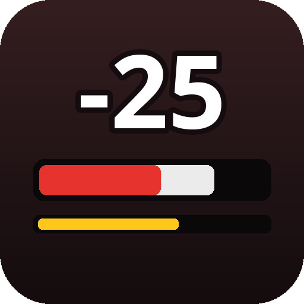
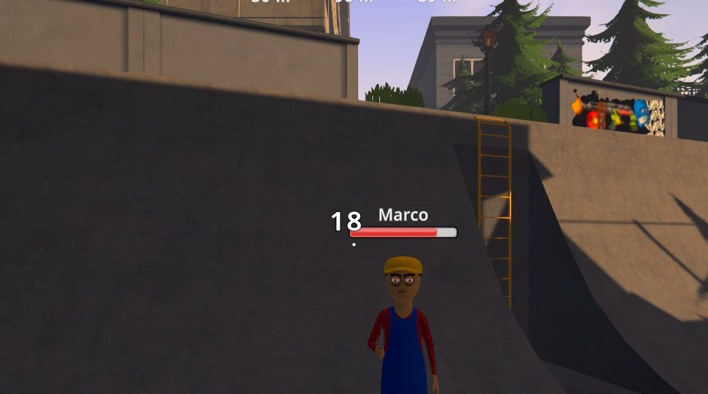
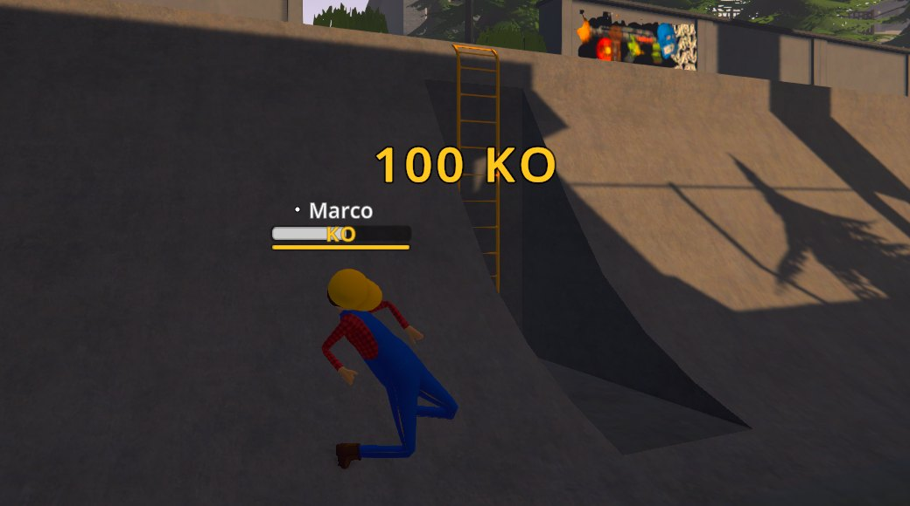
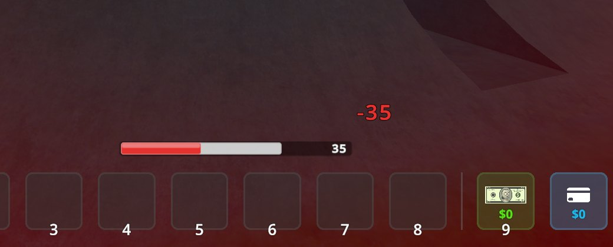
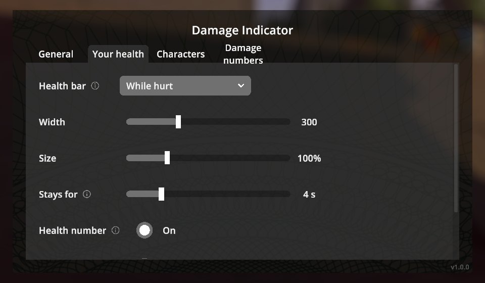

# Damage Indicator

Health bars and floating damage numbers for **Schedule I** — clean, readable, and out of the way:
nobody's health is shown until they actually take damage.

  
  

  
  

## Features

- **Health bars over characters** as soon as they take damage (from you, the police, anyone), fading
  out a few seconds later. The part just lost flashes white and drains away, so every hit reads at a glance.
- **Your own health bar**, hidden while you are at full health; it appears when you get hurt and
  stays until you are healed. Move it anywhere on the screen and resize it with the mouse.
- **Damage numbers** pop up where a character is hit: white for your hits, grey for others',
  yellow `KO` for a knock-out blow, red for a killing blow. Damage you take and healing you get
  (food, medicine) pop up next to your bar.
- **Stun bar** (yellow) under the health bar. Schedule I has no stun meter, so it shows the real stun
  states the game uses: tased (2 s), staggered by a heavy hit, knocked down — plus a **KO** badge
  for knocked-out characters and **DEAD** for dead ones.
- **Everything is configurable** in a native in-game screen (pause menu → **Damage Indicator**):
  when bars show, sizes, how long they stay, names, health numbers, which hits get numbers, and more.
- Works in single player and multiplayer (hits are seen on every client). Translated into all
  [Polyglot](../Polyglot) languages.

## Installation

1. Install [MelonLoader](https://github.com/LavaGang/MelonLoader/releases) 0.7.3 (0.7.1 is not supported).
2. Download `DamageIndicator-<version>-IL2CPP.zip` (default Steam branch) or `DamageIndicator-<version>-Mono.zip`
   (`alternate` branch) from [Releases](https://github.com/BbIJABNPOBATEJb/ScheduleI-Mods/releases).
3. Extract it into the game folder so that `Mods/DamageIndicator_Il2Cpp.dll` (or `_Mono.dll`) is in place.

Only install the build matching your game branch.

## Usage

Open **Pause menu → Damage Indicator**. **Move and resize your health bar** shows the bar with sample
values: drag it, use the mouse wheel to resize, right-click to reset, **Done** (or Enter) to finish.

## Configuration

Everything in the in-game screen is also in `UserData/MelonPreferences.cfg` under `[DamageIndicator]`:

| Setting | Default | |
|---|---|---|
| `PlayerBar` | `0` | Your bar: 0 while hurt, 1 after damage, 2 always, 3 never |
| `PlayerBarX`, `PlayerBarY`, `PlayerBarScale`, `PlayerBarWidth` | above the hotbar | Position (0–1 of the screen), size, width |
| `NpcBars` | `0` | Characters: 0 after damage, 1 also while they fight you, 2 never |
| `NpcHideDelay` / `PlayerHideDelay` | `6` / `4` | Seconds a bar stays |
| `NpcMaxDistance` | `60` | No bars for characters further away (m) |
| `DamageNumbers` | `0` | 0 all hits, 1 only yours, 2 off |
| `StunBars` | `true` | Yellow stun bar and KO badge |

## Changelog

See [CHANGELOG.md](CHANGELOG.md).

## License

MIT.
