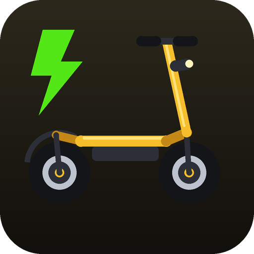
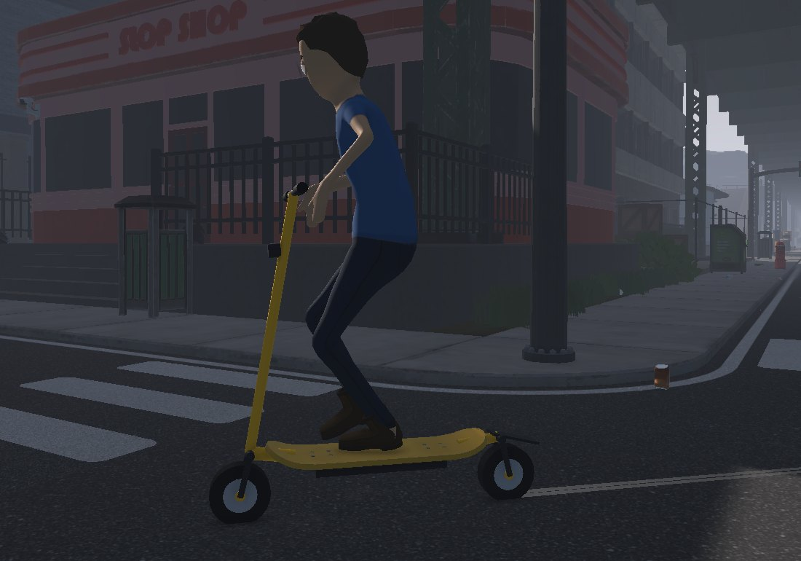
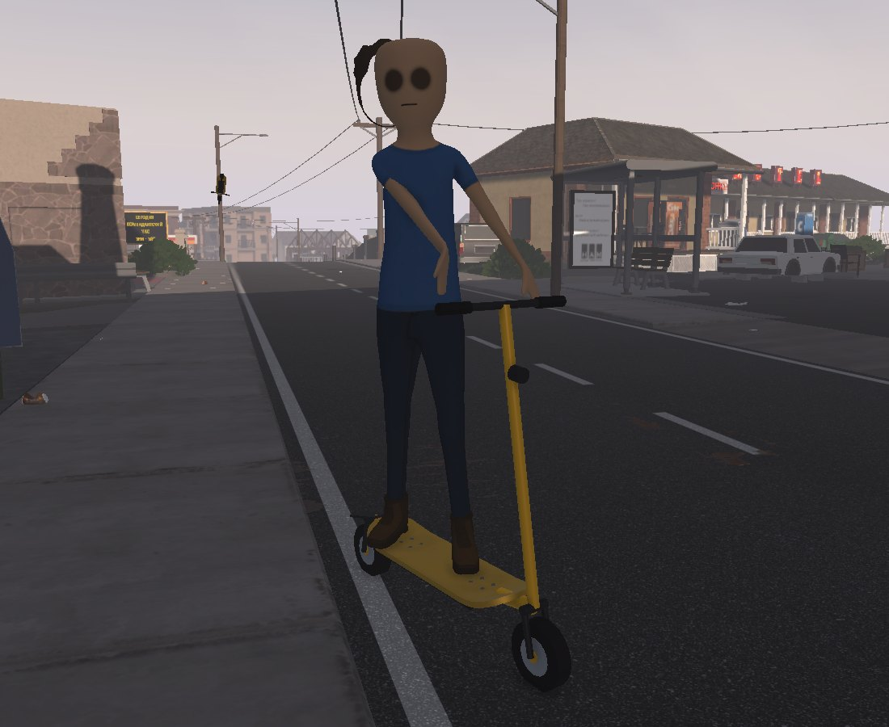
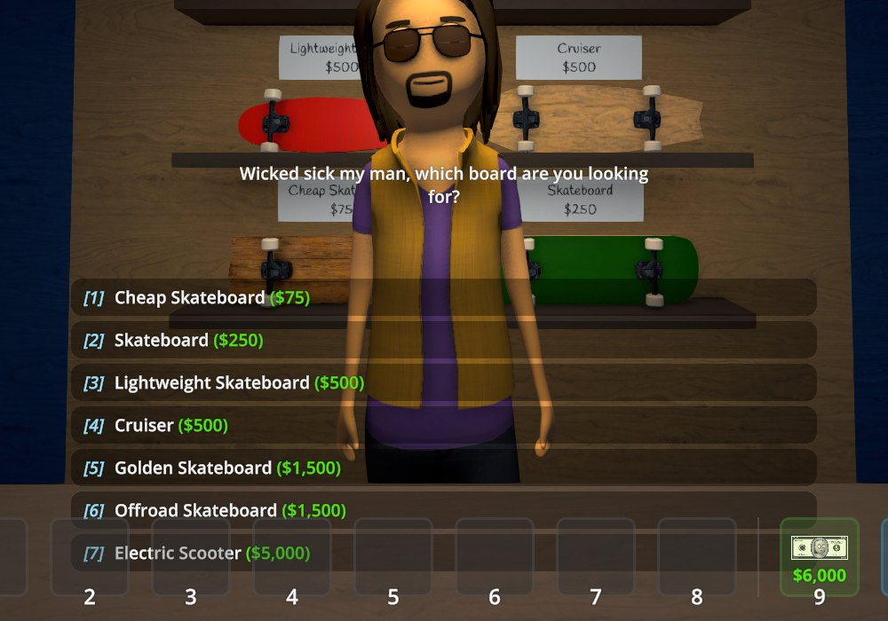
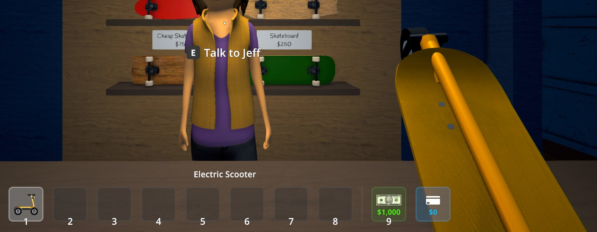

# Electric Scooter



A new ride for **Schedule I**: an electric scooter sold at the skate shop. It handles like the
Golden Skateboard, but it rolls over curbs instead of stopping at every one of them, costs no
stamina and is 30% faster.

<p>
  
  
</p>
<p>
  
  
</p>

## Features

- **Sold by Jeff at the skate shop** for $5,000, next to the skateboards. It is a normal item:
  it sits in your hotbar, can be stored, and is kept in your save.
- **Rides like the Golden Skateboard**: hold the left mouse button to get on, press it to get off;
  the same steering, braking and jumping.
- **Does not stop at curbs.** Skateboards ride so low that every curb of Hyland Point (9 cm) stops
  them. The scooter rides on big wheels and clears steps up to 20 cm.
- **No stamina.** It is electric: pushing off costs nothing, so you never have to stop and catch
  your breath.
- **30% faster** than the Golden Skateboard — top speed and acceleration alike.
- Its own look: big wheels, steering column with a handlebar (your character holds on to it), headlight
  and a battery under the deck. In your hands it is carried folded.
- Translated into all [Polyglot](../Polyglot) languages.

## Installation

**With a mod manager** (r2modman, Thunderstore App): install [ElectricScooter](https://thunderstore.io/c/schedule-i/p/BbIJABNPOBATEJb/ElectricScooter/) for the default Steam branch or [ElectricScooter_Mono](https://thunderstore.io/c/schedule-i/p/BbIJABNPOBATEJb/ElectricScooter_Mono/) for the `alternate` branch.

**Manually:**

1. Install [MelonLoader](https://github.com/LavaGang/MelonLoader/releases) 0.7.3 (0.7.1 is not supported).
2. Download `ElectricScooter-<version>-IL2CPP.zip` (default Steam branch) or `ElectricScooter-<version>-Mono.zip`
   (`alternate` branch) from [Releases](https://github.com/BbIJABNPOBATEJb/ScheduleI-Mods/releases).
3. Extract it into the game folder so that `Mods/ElectricScooter_Il2Cpp.dll` (or `_Mono.dll`) is in place.

Only install the build matching your game branch.

## Configuration

`UserData/MelonPreferences.cfg`:

```ini
[ElectricScooter]
Price = 5000            # price at the skate shop, $
SpeedPercent = 130      # speed compared to the Golden Skateboard, % (50-300)
StepHeightCm = 20       # how high a curb it rolls over, cm (10-40); the wheels grow with it
InfiniteStamina = true  # riding does not use stamina
```

Edit the file while the game is closed. If you change the values with an in-game preferences
editor, they apply the next time you get on the scooter.

## Multiplayer

Not tested in multiplayer yet. By design the rider's own game simulates the ride, so the scooter
should work for whoever has the mod; players without it would see a Golden Skateboard floating a
little higher than usual. Everyone who may handle the item (shared storage, handing it over) needs
the mod.

## Uninstalling

Sell or drop the scooter first. Without the mod the game does not know the item, and it disappears
from saves that contain it.

## Changelog

See [CHANGELOG.md](CHANGELOG.md).

## Credits

Developed with AI assistance (Claude by Anthropic) and tested in game on both branches with automated in-game tests.

## License

MIT.
