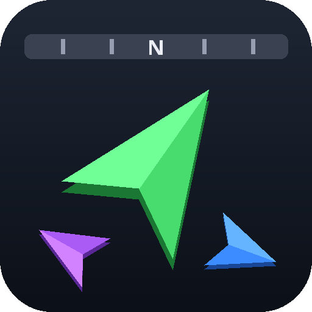
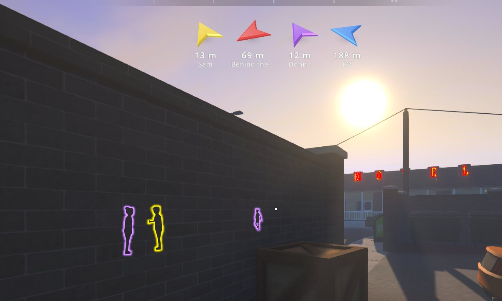
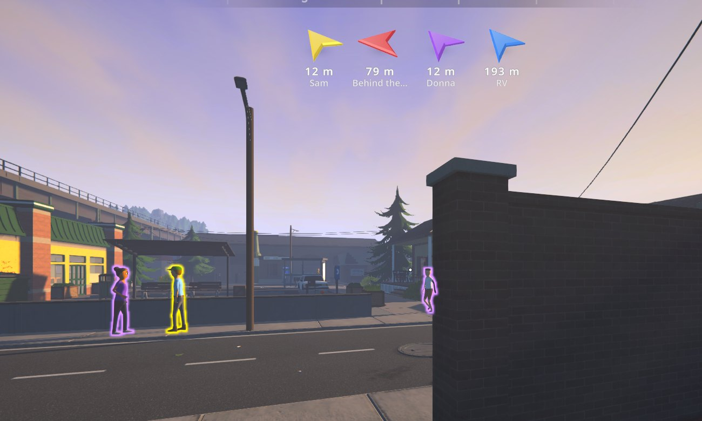
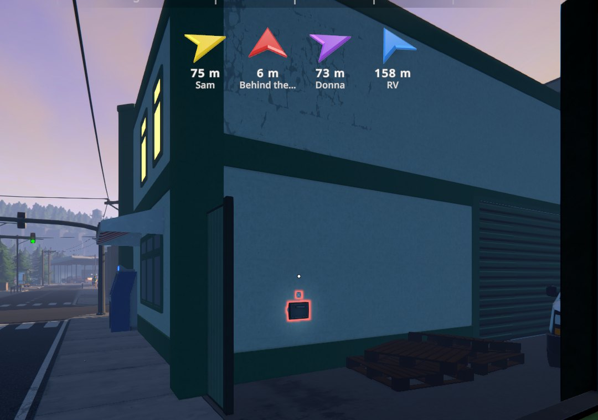
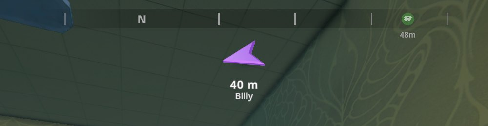
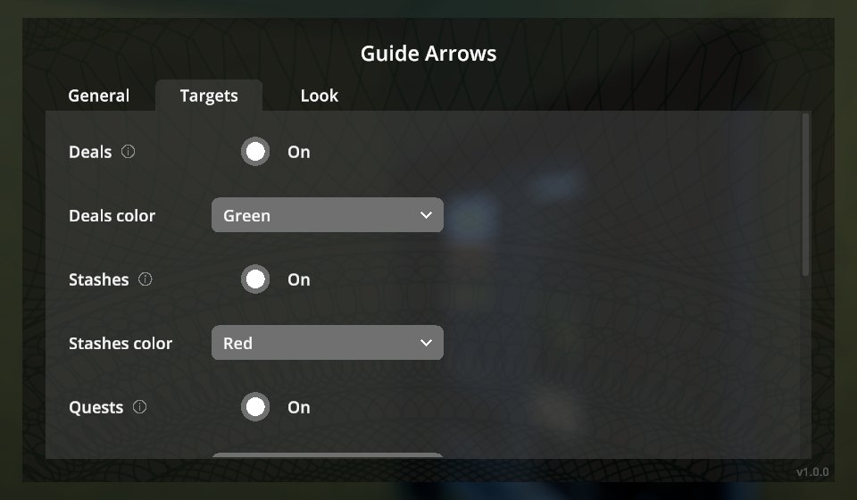

# Guide Arrows

3D arrows under the compass that always point at the nearest thing that needs you — colored by what
it is. No more opening the map to find your next deal.

  

  
  

  
  

  

## Features

| Color (default) | Points at |
|---|---|
| 🟢 Green | **Deals** — customers waiting for a delivery you accepted |
| 🟡 Yellow | **Buyers** — your customers who would buy from you right now (no deal pending, not served by your dealers, no purchase in the last few hours) |
| 🔴 Red | **Stashes** — dead drops with items in them (e.g. a supplier's order) |
| 🟠 Orange | **Quests** — the current objectives of your tracked quests |
| 🟣 Purple | **Potential customers** — people you can offer a free sample to right now (not those who turned you down today) |
| 🔵 Blue | **Home base** — the property you last slept in, or the one with the most valuable equipment |

- The arrows are real 3D, glassy and lit the same day and night. They turn smoothly relative to
  where you look and tilt up or down for targets above or below you. The distance is shown underneath
  (meters or feet, following the game's unit setting).
- **Outlines**: the people and stashes the arrows point at glow in the arrow's color, visible through
  walls and buildings, and keep glowing as you walk up to them. All buyers and potential customers
  nearby glow too (yellow / purple), not only the ones with an arrow.
- **One arrow per kind** (the nearest of each), **a single arrow** to the nearest target of any kind,
  or **arrows to the nearest few** targets.
- Labels show who or what each arrow points at (the customer's name, the quest step...). Arrows
  can hide when you get close and ignore far targets.
- **Everything is configurable** in a native in-game screen (pause menu → **Guide Arrows**): kinds,
  colors, size, spacing, view angle, turn speed, opacity... Drag the row anywhere and resize it with
  the mouse. **F7** shows/hides the arrows.
- Translated into all [Polyglot](../Polyglot) languages.

## Installation

**With a mod manager** (r2modman, Thunderstore App): install [GuideArrows](https://thunderstore.io/c/schedule-i/p/BbIJABNPOBATEJb/GuideArrows/) for the default Steam branch or [GuideArrows_Mono](https://thunderstore.io/c/schedule-i/p/BbIJABNPOBATEJb/GuideArrows_Mono/) for the `alternate` branch. Also on [Nexus Mods](https://www.nexusmods.com/schedule1/mods/2750).

**Manually:**

1. Install [MelonLoader](https://github.com/LavaGang/MelonLoader/releases) 0.7.3 (0.7.1 is not supported).
2. Download `GuideArrows-<version>-IL2CPP.zip` (default Steam branch) or `GuideArrows-<version>-Mono.zip`
   (`alternate` branch) from [Releases](https://github.com/BbIJABNPOBATEJb/ScheduleI-Mods/releases).
3. Extract it into the game folder so that `Mods/GuideArrows_Il2Cpp.dll` (or `_Mono.dll`) is in place.

Only install the build matching your game branch.

## Usage

The arrows appear under the compass whenever the compass is shown. Settings: **Pause menu → Guide Arrows**.
**Move and resize the arrows** shows sample arrows: drag them, mouse wheel to resize, right-click to
reset, **Done** (or Enter) to finish.

The home base remembers where you last slept per world (`UserData/GuideArrows/worlds/`); until you
sleep somewhere, the property with the most valuable equipment is used.

## Configuration

Everything in the in-game screen is also in `UserData/MelonPreferences.cfg` under `[GuideArrows]`,
e.g. `ToggleKey = "F7"` (`"None"` disables it), `Mode` (0 per kind, 1 nearest, 2 nearest few),
`Show<Kind>` / `Color<Kind>`, `ArrowSize`, `ViewAngle`, `TurnSpeed`, `HideWithin`, `MaxDistance`,
`Outline` (`false` turns the outlines off), `OutlineAll` and `OutlineRange` (outlines on every buyer and
potential customer within this many meters).

## Changelog

See [CHANGELOG.md](CHANGELOG.md).

## Credits

Developed with AI assistance (Claude by Anthropic) and tested in game on both branches with automated in-game tests.

## License

MIT.
