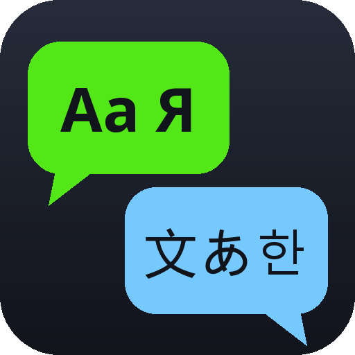
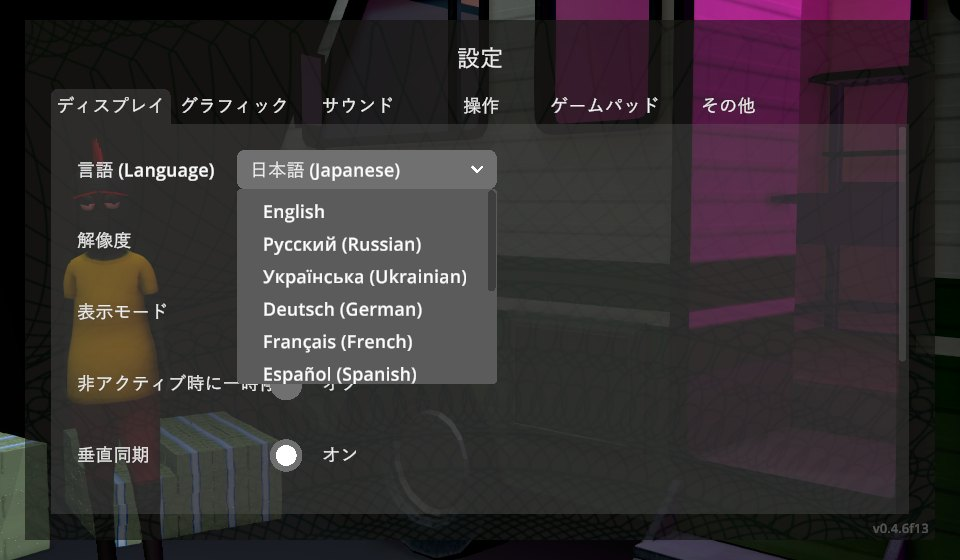
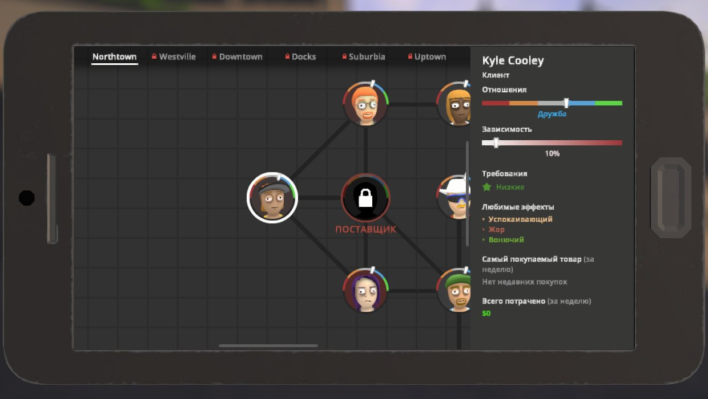
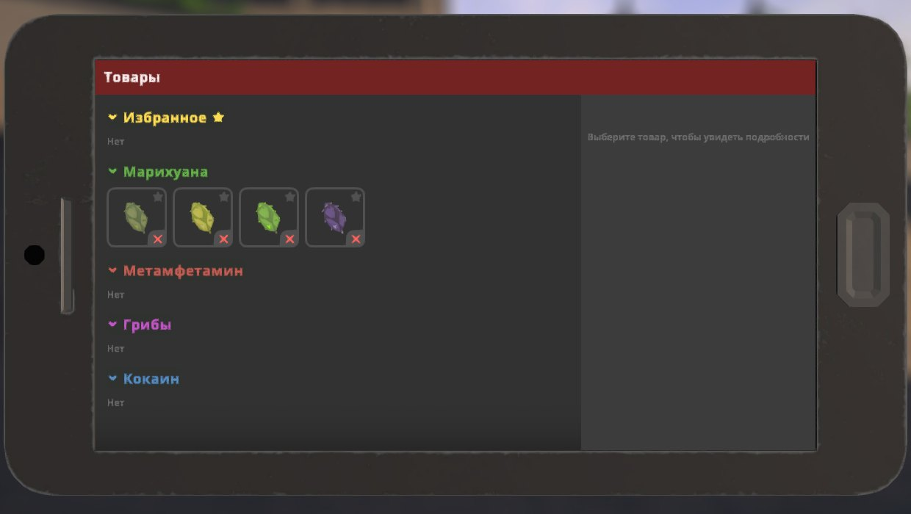
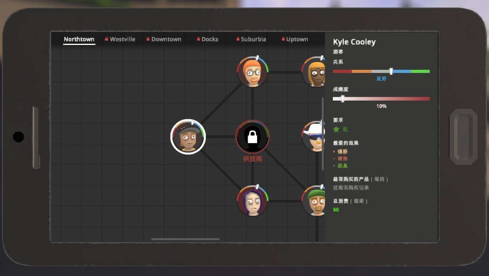

# Polyglot



Play **Schedule I** in 13 languages and switch between them instantly — no restart, no extra
downloads, everything in one mod.

**English · Русский · Українська · Deutsch · Français · Español · Português (Brasil) · Italiano ·
Polski · Türkçe · 简体中文 · 日本語 · 한국어**

<p>
  
  
</p>
<p>
  
  
</p>

## Features

- Full translation of the game: menus, settings, HUD, phone apps, items, quests, dialogue, phone
  calls, hints, notifications, the tutorial — about 4,000 strings per language.
- Switch languages live: **Settings → Display → Language** (the game's own dropdown, in the main menu
  and the pause menu) or press **F9** to cycle.
- Looks like the original: Cyrillic, Latin Extended and Greek are drawn with the same Open Sans
  weights the game uses; Chinese, Japanese and Korean use Windows system fonts.
- Longer translations are fitted into the game's fixed-size labels automatically instead of being cut off.
- Safe: translation happens only when text is drawn, the game keeps working with its English strings,
  so game logic, saves and multiplayer are unaffected. Players in one lobby can use different languages.
- Dynamic text (prices, amounts, names, times) is handled with number and placeholder templates.
- Easy to extend: drop your own translation files into `UserData`, or add a whole new language.

## Installation

**With a mod manager** (r2modman, Thunderstore App): install [Polyglot](https://thunderstore.io/c/schedule-i/p/BbIJABNPOBATEJb/Polyglot/) for the default Steam branch or [Polyglot_Mono](https://thunderstore.io/c/schedule-i/p/BbIJABNPOBATEJb/Polyglot_Mono/) for the `alternate` branch.

**Manually:**

1. Install [MelonLoader](https://github.com/LavaGang/MelonLoader/releases) 0.7.3 (0.7.1 is not supported).
2. Download `Polyglot-<version>-IL2CPP.zip` (default Steam branch) or `Polyglot-<version>-Mono.zip`
   (`alternate` branch) from [Releases](https://github.com/BbIJABNPOBATEJb/ScheduleI-Mods/releases).
3. Extract it into the game folder so that `Mods/Polyglot_Il2Cpp.dll` (or `_Mono.dll`) is in place.
4. Start the game and pick your language in **Settings → Display**.

Only install the build matching your game branch.

## Configuration

`UserData/MelonPreferences.cfg`:

```ini
[Polyglot]
Language = "en"          # active language code; also set from the Settings screen
CycleHotkey = "F9"       # key that switches to the next language, "None" to disable
CycleLanguages = ""      # languages the hotkey cycles through, e.g. "en,ru" (empty = all)
LogUntranslated = false  # collect untranslated texts into UserData/Polyglot/untranslated_<code>.txt
CustomFontPath = ""      # .ttf/.otf/.ttc used as last-resort fallback (e.g. CJK on Linux/Proton)
```

## Translations

Built-in translations live in [`languages/<code>.txt`](languages). Your own files in
`UserData/Polyglot/languages/<code>/*.txt` are loaded on top and override built-in entries; a folder
with a new code adds a new language.

```
// comment
@name=Русский                 native name shown in the language list (also @english=, @script=)
Continue=Продолжить           exact text
Day {0}=День {0}              {0}, {1}… stand for numbers in the text
It'll cost <PRICE>.=Это будет стоить <PRICE>.        game placeholders are matched and re-inserted
r:"^Sold (.+) to (.+)$"=Продано: $1 → $2              regex rules (captured groups are translated too)
```

Escapes: `\n`, `\t`, `\\`, `\=` (a literal `=` in the key). Rich-text tags (`<color=…>`, `<b>`…)
must be kept as in the English text.

To find missing strings, set `LogUntranslated = true`, play a bit, and fill in the generated
`UserData/Polyglot/untranslated_<code>.txt` (it's already in the right format). Pull requests with
fixes are welcome; per-language terminology is kept in [`corpus/tr/<code>/glossary.md`](../../corpus/tr).

## Known limitations

- Text baked into textures (signs, posters) and item/product/place names that are proper nouns stay in English.
- A few English words are used by the game for two different things (e.g. "Cool" is both the air
  conditioner mode and a customer reply), so one of the two reads a bit off.
- On Linux/Proton the CJK system fonts may be missing — set `CustomFontPath` to a font that has the glyphs.

## Changelog

See [CHANGELOG.md](CHANGELOG.md).

## Credits

Developed with AI assistance (Claude by Anthropic): the code and the translations were produced with AI, then checked in game on both branches with automated in-game tests. Native speakers' corrections are very welcome.

## License

MIT. Open Sans and Caveat fonts: SIL Open Font License 1.1 ([OFL.txt](fonts/OFL.txt), [OFL-Caveat.txt](fonts/OFL-Caveat.txt)).
