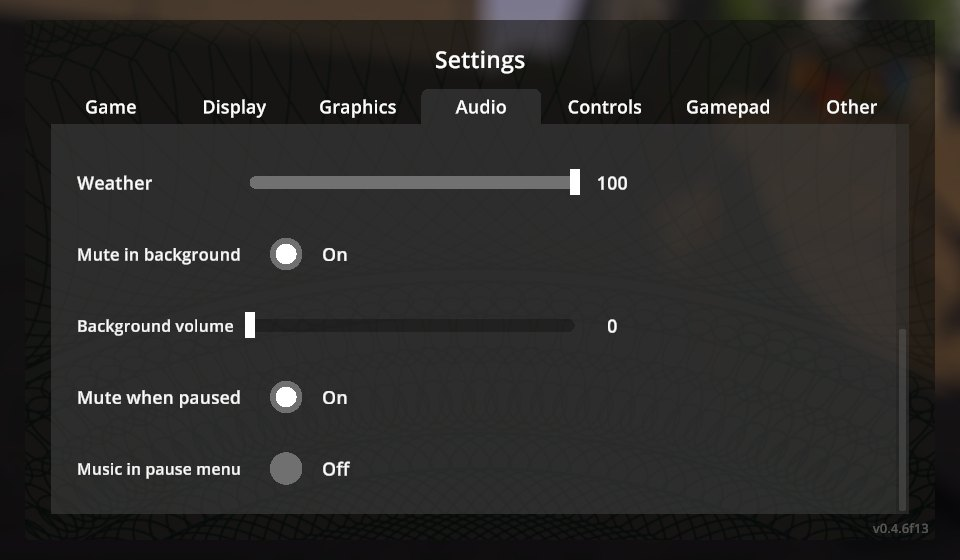

# Quiet Pause


Schedule I keeps playing every sound while it is minimized and while the pause menu is open.
Quiet Pause fixes both:

- **Mute in background** — silent while the window is minimized or another window has focus;
  fades back in when you return. Or keep a low background volume if you prefer.
- **Mute when paused** — world sounds (ambience, footsteps, vehicles, voices, weather) pause while
  the pause menu is open and resume exactly where they stopped. Menu clicks stay audible; music can
  keep playing if you like.



The options are added to the game's own **Settings → Audio** tab (main menu and pause menu),
translated by [Polyglot](../Polyglot).

## Installation

1. Install [MelonLoader](https://github.com/LavaGang/MelonLoader/releases) 0.7.3 (0.7.1 is not supported).
2. Download `QuietPause-<version>-IL2CPP.zip` (default Steam branch) or `QuietPause-<version>-Mono.zip`
   (`alternate` branch) from [Releases](https://github.com/BbIJABNPOBATEJb/ScheduleI-Mods/releases).
3. Extract it into the game folder so that `Mods/QuietPause_Il2Cpp.dll` (or `_Mono.dll`) is in place.

## Configuration

`UserData/MelonPreferences.cfg`:

```ini
[QuietPause]
MuteInBackground = true   # silent while minimized / unfocused
BackgroundVolume = 0      # 0-100 % volume in the background
MuteWhenPaused = true     # pause world sounds in the pause menu
MusicWhenPaused = false   # keep the music playing in the pause menu
```

## Changelog

See [CHANGELOG.md](CHANGELOG.md).

## License

MIT.
