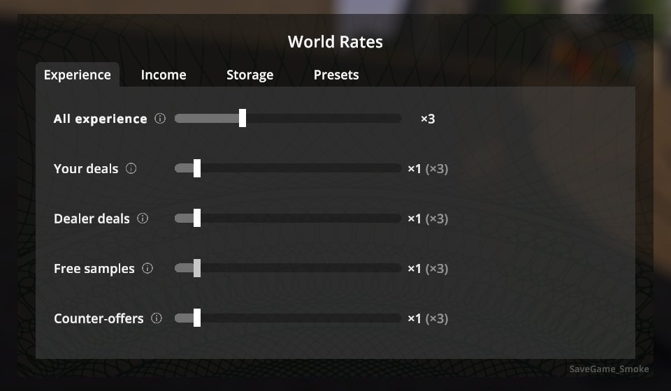
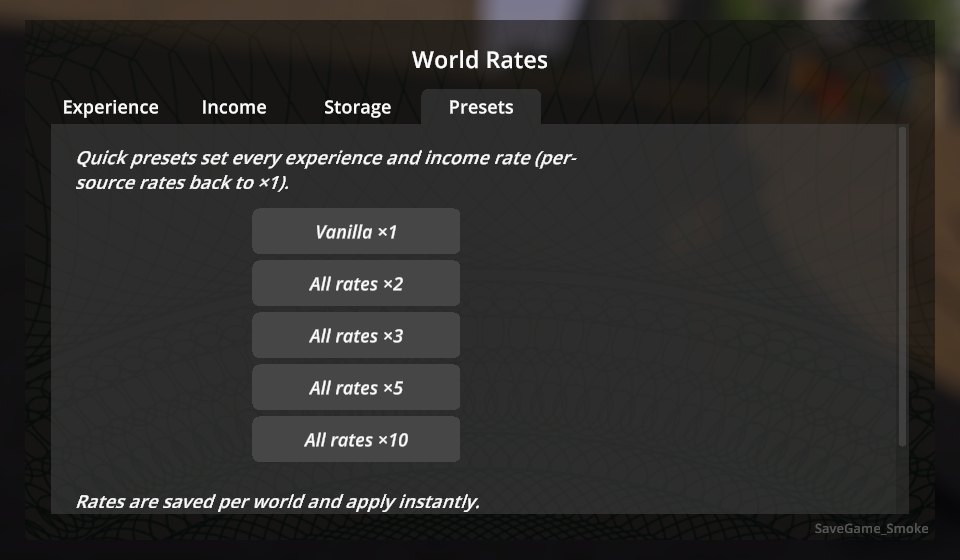
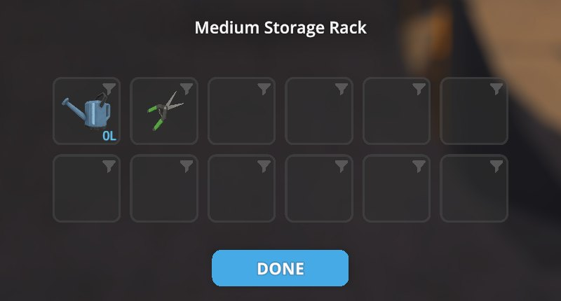
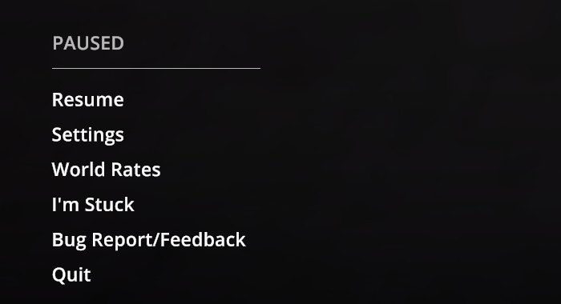
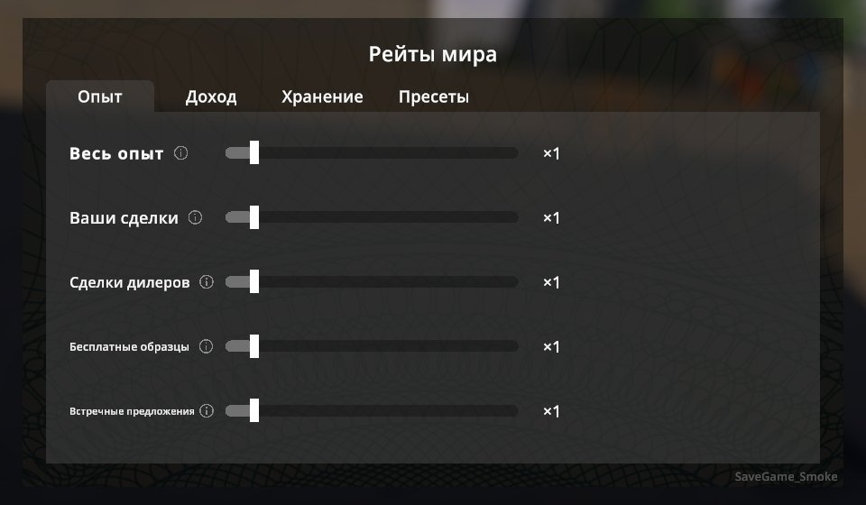

# World Rates


Server-style rates for **Schedule I**, like the "x2 / x3 / x10" servers in Rust: multiply XP,
income and storage capacity — per source, per world, from a native in-game window, with no restart.

<p>
  
  
</p>
<p>
  
  
</p>

## Features

| Tab | Rates |
|---|---|
| **Experience** | *All experience*, plus per source: your deals, dealer deals, free samples, counter-offers, harvesting, new mixes, quests, escaping the police, graffiti, pickpocketing, other |
| **Income** | *All income*, plus per source: your deals (bonuses included), dealer sales, laundering, pawn shop, recycling |
| **Storage** | Placed storage (racks, shelves, safes, tables, briefcases…) and your own vehicles' trunks, ×1–×4 up to 20 slots |
| **Presets** | Vanilla ×1 · All rates ×2 · ×3 · ×5 · ×10 · "use these rates for new worlds" |

- Per-source rates multiply with the *All* rate of their tab; the window shows the effective value,
  e.g. `×2 (×6)`. Rates range from 0 (off) to ×10.
- Changes apply instantly. Every world keeps its own settings.
- Deal payments are scaled before the game uses them, so the deal popup, bonuses, dealer cuts and
  the daily summary all show the boosted amounts.
- Storage is resized live. Items are never deleted: shrinking only removes empty slots at the end,
  and loading a save grows a storage back to the size its items need.
- The window is built from the game's own Settings screen (tabs, sliders, tooltips), so it looks and
  navigates like the rest of the game. Works with [Polyglot](../Polyglot) — the window is translated
  into all its languages:

  

## Installation

1. Install [MelonLoader](https://github.com/LavaGang/MelonLoader/releases) 0.7.3 (0.7.1 is not supported).
2. Download `WorldRates-<version>-IL2CPP.zip` (default Steam branch) or `WorldRates-<version>-Mono.zip`
   (`alternate` branch) from [Releases](https://github.com/BbIJABNPOBATEJb/ScheduleI-Mods/releases).
3. Extract it into the game folder so that `Mods/WorldRates_Il2Cpp.dll` (or `_Mono.dll`) is in place.

Only install the build matching your game branch.

## Usage

Open **Pause menu → World Rates** or press **F10** while in a world.

## Configuration

`UserData/MelonPreferences.cfg`:

```ini
[WorldRates]
WindowHotkey = "F10"   # opens the window; "None" to disable
DebugLog = false       # log every scaled XP gain
```

Rates are stored per world in `UserData/WorldRates/worlds/<steam id>_<save slot>.cfg`
(plain `id=value` lines); new worlds start from `UserData/WorldRates/defaults.cfg`, which the
*"Use these rates for new worlds"* button writes.

## Multiplayer

Rates are applied by the host; for other players the window is read-only. Settings are not synced to
clients yet, and XP from a few actions that run on a client's machine (e.g. a client's pickpocketing)
is not scaled.

## Uninstalling

Set **Storage** back to ×1 and take items out of the extra slots first — without the mod the game
only loads its own slot count, so items in the extra slots would be lost.

## Changelog

See [CHANGELOG.md](CHANGELOG.md).

## License

MIT.
